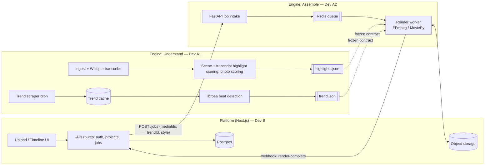

# AiFun — Auto Reel Generator

Automatically turn a user's raw videos/photos into a trend-aware, ready-to-post
vertical reel: pick the best moments, sync them to a trending sound, add
captions/text, and export a 9:16 mp4 — for **$0/month** at small scale.

Three-track project — Platform, and the backend Reel Engine split into
Understand / Assemble. Split so each track can be built, tested, and
deployed almost completely independently (see [Team Split](#team-split)).

---

## 1. Features

| # | Feature | Description |
|---|---|---|
| 1 | Media ingestion | Upload videos/photos, store, thumbnail, tag |
| 2 | Trend radar | Pull trending audio/hashtags/effects (TikTok, YT Shorts) on a schedule |
| 3 | Smart clip selection | Auto-detect scenes, score for motion/faces/sharpness, pick the best N seconds |
| 4 | Photo scoring | Rank uploaded photos for use in photo-mode reels |
| 5 | Beat-synced cutting | Cut clips on the beat of the chosen trending track |
| 6 | Auto captions | Local speech-to-text, burned-in animated captions |
| 7 | Auto assembly | Crop/resize to 9:16, transitions, text overlays, mixed audio, render mp4 |
| 8 | Preview & edit | Web timeline to reorder/trim/swap clips and regenerate |
| 9 | Job queue + status | Async rendering with live progress |
| 10 | Auth & projects | Accounts, saved projects, reel history |
| 11 | *(stretch)* Auto-publish | Post directly to Instagram/TikTok via their official APIs |

---

## 2. Architecture

Two services talking over a small, frozen REST + webhook contract — this is
what lets the two devs work independently.



- **Contract file:** `/contracts/render-job.schema.json` — agree on this in
  Phase 0 and freeze it. Each side mocks the other against it.
- **Dev B** mocks the Engine with a fake job that "completes" after a few
  seconds and returns a sample video.
- **Dev A1 / Dev A2** split the Engine itself along the same principle —
  see [Team Split](#team-split). Two more contracts freeze that internal
  seam: `contracts/highlight.schema.json` and `contracts/trend.schema.json`.
- Each side (Platform, Engine: Understand, Engine: Assemble) tests standalone
  with curl/Postman/pytest against fixture JSON matching the frozen
  contracts — no other side's code needs to be running.

---

## 3. Tech Stack

### Frontend + Platform (Dev B)
- **Next.js 14+ (App Router, TypeScript)**
- **Tailwind CSS + shadcn/ui**
- **React Query** (server state) + **Zustand** (UI state)
- Native `<video>` / **react-player** for preview
- Chunked uploads via presigned URLs (Uppy or plain `fetch`)
- **NextAuth.js** or **Supabase Auth** for login
- **Prisma** ORM over **Supabase Postgres** (free tier)
- Storage: **Supabase Storage** or **Cloudflare R2** (10 GB free, no egress fee)
- Hosting: **Vercel** (Hobby, free)

### Reel Engine (Dev A)
- **Python 3.11 + FastAPI** — job intake API
- **Celery or RQ + Redis** — async job queue
- **FFmpeg** — crop/resize/mux/final render
- **MoviePy** — clip composition on top of FFmpeg
- **OpenCV + PySceneDetect** — shot boundary detection, motion/face scoring
- **librosa** — beat/tempo detection for music sync
- **openai-whisper** (local, `tiny`/`base` model, CPU-friendly) — captions
- *(optional)* **Ollama + a small local LLM** (e.g. `llama3.2:3b`) — caption
  copy / hashtag suggestions, fully local
- **Playwright** or `requests` + `BeautifulSoup` — pull public trend data
- Hosting: self-hosted on a dev machine, or a small VM — this is the only
  compute-heavy piece, keep it local to stay at $0

### Shared infra
- **Docker Compose** for local dev (redis, postgres, both services)
- **GitHub Actions** (free tier, 2,000 min/mo) for CI
- **GitHub** for repo, PRs, issues

---

## 4. Cost Breakdown — target: $0/reel

| Component | Zero-cost option | Paid upgrade (only if you outgrow free tier) |
|---|---|---|
| Frontend hosting | Vercel Hobby | Custom domain/team seats |
| API hosting | Render/Railway free tier, or self-host | Sustained traffic beyond free tier |
| Database | Supabase free (500 MB) | More storage / compute |
| Object storage | Cloudflare R2 free (10 GB) | >10 GB media |
| Queue | Local Redis (Docker) or Upstash free (10k cmds/day) | High job volume |
| Video rendering | Your own laptop/desktop CPU (FFmpeg, MoviePy, Whisper) | Rented cloud CPU/GPU for speed/scale |
| Speech-to-text | Whisper, local, open-source | Cloud STT (Google/AssemblyAI) for higher accuracy |
| Caption/copy text | Local LLM via Ollama | Cloud LLM API (~$0.001–0.01/reel) for better quality |
| Trending data | Public TikTok Creative Center + YouTube Data API free quota | Official Research/paid trend APIs |
| Auto-publish | Free tier of Meta Graph API / TikTok Content Posting API (needs app review) | N/A — stays free |

**Estimated marginal cost per generated reel: $0.00** — everything runs on
open-source models and your own compute. The only realistic upgrade path is
swapping the local LLM for a cloud one for nicer captions, which is pennies
per reel, not dollars.

> ⚠️ Scraping trend pages and reusing trending audio has ToS/copyright
> implications. Fine for personal or learning use; check each platform's
> terms before doing anything at scale or commercially. Auto-publishing
> requires a (free but reviewed) developer app on each platform.

---

## 5. Step-by-Step Build Guide

**Phase 0 — Setup (all three, ~1-2 days)**
1. Repo layout: `/web` (Platform) and `/engine` (Reel Engine) — separate
   deployable services, either in one repo or two.
2. Write and freeze the contracts everyone codes against:
   - `/contracts/render-job.schema.json` (Platform ↔ Engine: job request,
     webhook payload).
   - `/contracts/highlight.schema.json` and `/contracts/trend.schema.json`
     (Engine-internal: Dev A1 ↔ Dev A2 — see [Team Split](#team-split)).
3. `docker-compose.yml` with `redis` + `postgres` for local dev.

**Phase 1 — Platform MVP (Dev B)**
4. Auth + project CRUD.
5. Media upload → object storage via presigned URLs.
6. "Generate reel" flow that POSTs a job to a *mocked* Engine and shows a
   fake progress bar → preview player.

**Phase 2 — Engine: Assemble MVP (Dev A2)**
7. FastAPI job intake + Redis-backed worker skeleton.
8. Basic FFmpeg pipeline driven by a *fixture* `highlights.json` (hand-written,
   matching the frozen contract — no real analysis yet): concatenate the
   given clips, crop to 9:16, lay a fixed audio track underneath, export mp4.
9. Webhook callback to Platform on completion.

**Phase 3 — Engine: Understand MVP (Dev A1, parallel with Phase 2)**
10. Ingest loader + Whisper transcription.
11. PySceneDetect + OpenCV scene scoring, combined with transcript scoring,
    to auto-pick the best segments → emit `highlights.json` against the same
    contract Dev A2 already built Phase 2 against.
12. Aesthetic/quality scoring for photos (sharpness, exposure, face
    presence) for photo-mode reels.

**Phase 4 — Smart editing & captions (Dev A2, once Phase 3 lands)**
13. Swap the Phase 2 fixture for Dev A1's real `highlights.json`.
14. Burn in Whisper-transcript captions; audio normalize.

**Phase 5 — Trend intelligence (Dev A1, can start anytime after Phase 0,
fully parallel with Phases 2-4)**
15. Scraper/cron pulling trending sounds/hashtags (TikTok Creative Center
    public trends page, YouTube trending Shorts via Data API free quota).
16. Trend cache table + "list current trends" / "pick a trend" endpoint.
17. librosa beat detection on the chosen track → emit `trend.json` (audio
    path + beat grid) against the frozen contract.

**Phase 6 — Beat-synced cutting (Dev A2, once Phase 5 lands)**
18. Consume Dev A1's `trend.json` for beat-synced cut points.

**Phase 7 — Editing & polish (Dev B)**
19. Timeline UI: reorder/trim/swap clips, swap the trend/music, regenerate
    a single segment instead of the whole reel.
20. Style presets — font/color/transition packs.

**Phase 8 — Publishing (optional/stretch, any dev)**
21. Instagram Graph API + TikTok Content Posting API integration.
22. Scheduling / queueing of posts.

---

## 6. Team Split

Three independent tracks, each touching the others only through a frozen
contract — build, test, and deploy each on its own.

```
Platform (Dev B)  <--REST + webhook-->  Engine: Assemble (Dev A2)  <--data contract-->  Engine: Understand (Dev A1)
```

**Dev A1 — Engine: Understand** (`engine/src/aifun/{ingest,transcribe,analysis}`
+ new `trend/`)
Owns: video ingest, Whisper transcription, scene + transcript highlight
scoring, photo scoring, trend scraping, librosa beat detection.
Produces: `highlights.json` (segments + scores) and `trend.json` (audio +
beat grid), each validated against its frozen schema.
Tests standalone: CLI/pytest on sample videos — no queue, no API, no A2 or
Dev B code needs to run.

**Dev A2 — Engine: Assemble** (`engine/src/aifun/{editing,render,export}`
+ new job-intake API and Redis worker)
Owns: FastAPI job intake, Redis queue/worker, clip cutting, reframe to
9:16, caption burn-in, audio mix/normalize, FFmpeg/MoviePy render, export,
webhook to Platform.
Consumes: `highlights.json` + `trend.json` — starts against hand-written
fixtures matching the contract (Phase 2) so it never blocks on A1's real
output landing (swapped in at Phase 4/6).
Tests standalone: curl/Postman/pytest against fixture JSON — no real
analysis, no Dev B, needed.

**Dev B — Platform** (`/web`, Next.js, product/UI-heavy)
Owns: auth, project/media management, upload, timeline editor UI, job
orchestration & status, (optional) social publishing integrations.

**Integration points (4 total — 2 network, 2 in-process):**
- `POST /jobs` — Platform → Engine (A2), submit a render job. *(network,
  `contracts/render-job.schema.json`)*
- `POST /webhooks/render-complete` — Engine (A2) → Platform, deliver the
  result. *(network, same schema)*
- `highlights.json` — A1 → A2, chosen segments to cut/caption. *(in-process
  — same Python package — `contracts/highlight.schema.json`)*
- `trend.json` — A1 → A2, audio track + beat grid for beat-synced cutting.
  *(in-process, `contracts/trend.schema.json`)*

---

## 7. Suggested Repo Structure

```
AiFun/
├── web/                        # Dev B — Next.js platform
├── engine/                     # Python reel engine
│   └── src/aifun/
│       ├── ingest/              ─┐
│       ├── transcribe/           │ Dev A1 — Understand
│       ├── analysis/             │ (-> highlights.json)
│       ├── trend/                │ Dev A1 — Understand
│       │                        ─┘ (-> trend.json)
│       ├── editing/             ─┐
│       ├── render/               │ Dev A2 — Assemble
│       ├── export/               │ (consumes highlights.json/trend.json)
│       └── api/, worker/        ─┘ (job intake + queue, new)
├── contracts/                  # shared schemas (source of truth)
│   ├── render-job.schema.json   # Platform <-> Engine (network)
│   ├── highlight.schema.json    # Dev A1 <-> Dev A2 (in-process)
│   └── trend.schema.json        # Dev A1 <-> Dev A2 (in-process)
├── docker-compose.yml
└── README.md
```

## 8. Getting Started (local dev)

```bash
git clone https://github.com/AkashPatra12/AiFun.git
cd AiFun
docker compose up -d          # redis + postgres

cd web && npm install && npm run dev        # Platform, Dev B
cd ../engine && pip install -r requirements.txt && uvicorn main:app --reload  # Engine, Dev A
```
