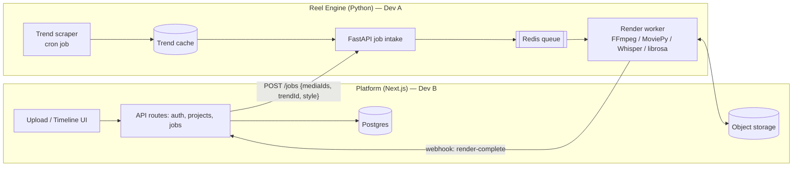

# AiFun — Auto Reel Generator

Automatically turn a user's raw videos/photos into a trend-aware, ready-to-post
vertical reel: pick the best moments, sync them to a trending sound, add
captions/text, and export a 9:16 mp4 — for **$0/month** at small scale.

Two-developer project. Split so the two halves can be built, tested, and
deployed almost completely independently (see [Team Split](#team-split)).

---

## 1. Features

| # | Feature | Description |
|---|---|---|
| 1 | Media ingestion | Upload videos/photos, store, thumbnail, tag |
| 2 | Trend radar | Pull trending audio/hashtags/effects (TikTok, YT Shorts) on a schedule |
| 3 | Smart clip selection | Auto-detect scenes, score for motion/faces/sharpness, pick the best N seconds |
| 4 | Photo scoring | Rank uploaded photos for use in photo-mode reels |
| 5 | Beat-synced cutting | Cut clips on the beat of the chosen trending track |
| 6 | Auto captions | Local speech-to-text, burned-in animated captions |
| 7 | Auto assembly | Crop/resize to 9:16, transitions, text overlays, mixed audio, render mp4 |
| 8 | Preview & edit | Web timeline to reorder/trim/swap clips and regenerate |
| 9 | Job queue + status | Async rendering with live progress |
| 10 | Auth & projects | Accounts, saved projects, reel history |
| 11 | *(stretch)* Auto-publish | Post directly to Instagram/TikTok via their official APIs |

---

## 2. Architecture

Two services talking over a small, frozen REST + webhook contract — this is
what lets the two devs work independently.



- **Contract file:** `/contracts/render-job.schema.json` — agree on this in
  Phase 0 and freeze it. Each side mocks the other against it.
- **Dev B** mocks the Engine with a fake job that "completes" after a few
  seconds and returns a sample video.
- **Dev A** tests the Engine standalone with curl/Postman/pytest — no UI
  needed.

---

## 3. Tech Stack

### Frontend + Platform (Dev B)
- **Next.js 14+ (App Router, TypeScript)**
- **Tailwind CSS + shadcn/ui**
- **React Query** (server state) + **Zustand** (UI state)
- Native `<video>` / **react-player** for preview
- Chunked uploads via presigned URLs (Uppy or plain `fetch`)
- **NextAuth.js** or **Supabase Auth** for login
- **Prisma** ORM over **Supabase Postgres** (free tier)
- Storage: **Supabase Storage** or **Cloudflare R2** (10 GB free, no egress fee)
- Hosting: **Vercel** (Hobby, free)

### Reel Engine (Dev A)
- **Python 3.11 + FastAPI** — job intake API
- **Celery or RQ + Redis** — async job queue
- **FFmpeg** — crop/resize/mux/final render
- **MoviePy** — clip composition on top of FFmpeg
- **OpenCV + PySceneDetect** — shot boundary detection, motion/face scoring
- **librosa** — beat/tempo detection for music sync
- **openai-whisper** (local, `tiny`/`base` model, CPU-friendly) — captions
- *(optional)* **Ollama + a small local LLM** (e.g. `llama3.2:3b`) — caption
  copy / hashtag suggestions, fully local
- **Playwright** or `requests` + `BeautifulSoup` — pull public trend data
- Hosting: self-hosted on a dev machine, or a small VM — this is the only
  compute-heavy piece, keep it local to stay at $0

### Shared infra
- **Docker Compose** for local dev (redis, postgres, both services)
- **GitHub Actions** (free tier, 2,000 min/mo) for CI
- **GitHub** for repo, PRs, issues

---

## 4. Cost Breakdown — target: $0/reel

| Component | Zero-cost option | Paid upgrade (only if you outgrow free tier) |
|---|---|---|
| Frontend hosting | Vercel Hobby | Custom domain/team seats |
| API hosting | Render/Railway free tier, or self-host | Sustained traffic beyond free tier |
| Database | Supabase free (500 MB) | More storage / compute |
| Object storage | Cloudflare R2 free (10 GB) | >10 GB media |
| Queue | Local Redis (Docker) or Upstash free (10k cmds/day) | High job volume |
| Video rendering | Your own laptop/desktop CPU (FFmpeg, MoviePy, Whisper) | Rented cloud CPU/GPU for speed/scale |
| Speech-to-text | Whisper, local, open-source | Cloud STT (Google/AssemblyAI) for higher accuracy |
| Caption/copy text | Local LLM via Ollama | Cloud LLM API (~$0.001–0.01/reel) for better quality |
| Trending data | Public TikTok Creative Center + YouTube Data API free quota | Official Research/paid trend APIs |
| Auto-publish | Free tier of Meta Graph API / TikTok Content Posting API (needs app review) | N/A — stays free |

**Estimated marginal cost per generated reel: $0.00** — everything runs on
open-source models and your own compute. The only realistic upgrade path is
swapping the local LLM for a cloud one for nicer captions, which is pennies
per reel, not dollars.

> ⚠️ Scraping trend pages and reusing trending audio has ToS/copyright
> implications. Fine for personal or learning use; check each platform's
> terms before doing anything at scale or commercially. Auto-publishing
> requires a (free but reviewed) developer app on each platform.

---

## 5. Step-by-Step Build Guide

**Phase 0 — Setup (both devs, ~1-2 days)**
1. Repo layout: `/web` (Platform) and `/engine` (Reel Engine) — separate
   deployable services, either in one repo or two.
2. Write and freeze `/contracts/render-job.schema.json` (job request shape,
   webhook payload shape).
3. `docker-compose.yml` with `redis` + `postgres` for local dev.

**Phase 1 — Platform MVP (Dev B)**
4. Auth + project CRUD.
5. Media upload → object storage via presigned URLs.
6. "Generate reel" flow that POSTs a job to a *mocked* Engine and shows a
   fake progress bar → preview player.

**Phase 2 — Engine MVP (Dev A)**
7. FastAPI job intake + Redis-backed worker skeleton.
8. Basic FFmpeg pipeline: concatenate selected clips, crop to 9:16, lay a
   fixed audio track underneath, export mp4.
9. Webhook callback to Platform on completion.

**Phase 3 — Smart selection & captions (Dev A)**
10. PySceneDetect + OpenCV scoring to auto-pick the best segments from long
    source videos.
11. Aesthetic/quality scoring for photos (sharpness, exposure, face
    presence) for photo-mode reels.
12. Whisper transcription → burned-in animated captions.

**Phase 4 — Trend intelligence (Dev A, can start in parallel with Phase 0)**
13. Scraper/cron pulling trending sounds/hashtags (TikTok Creative Center
    public trends page, YouTube trending Shorts via Data API free quota).
14. Trend cache table + "list current trends" / "pick a trend" endpoint.
15. librosa beat detection on the chosen track → beat-synced cut points.

**Phase 5 — Editing & polish (Dev B)**
16. Timeline UI: reorder/trim/swap clips, swap the trend/music, regenerate
    a single segment instead of the whole reel.
17. Style presets — font/color/transition packs.

**Phase 6 — Publishing (optional/stretch, either dev)**
18. Instagram Graph API + TikTok Content Posting API integration.
19. Scheduling / queueing of posts.

---

## 6. Team Split

Frontend+Platform and the Reel Engine only ever touch each other through the
REST + webhook contract, so once that contract is frozen in Phase 0 the two
tracks can be built, tested, and deployed independently.

**Dev A — Reel Engine** (`/engine`, Python, media/ML-heavy)
Owns: trend scraping, media analysis/scoring, beat-sync, captioning,
FFmpeg/MoviePy render pipeline, job queue worker.

**Dev B — Platform** (`/web`, Next.js, product/UI-heavy)
Owns: auth, project/media management, upload, timeline editor UI, job
orchestration & status, (optional) social publishing integrations.

**Integration points (only 2):**
- `POST /jobs` — Platform → Engine, submit a render job
- `POST /webhooks/render-complete` — Engine → Platform, deliver the result

---

## 7. Suggested Repo Structure

```
AiFun/
├── web/                # Dev B — Next.js platform
├── engine/             # Dev A — Python reel engine
├── contracts/          # shared API/job schemas (source of truth)
├── docker-compose.yml
└── README.md
```

## 8. Getting Started (local dev)

```bash
git clone https://github.com/AkashPatra12/AiFun.git
cd AiFun
docker compose up -d          # redis + postgres

cd web && npm install && npm run dev        # Platform, Dev B
cd ../engine && pip install -r requirements.txt && uvicorn main:app --reload  # Engine, Dev A
```
